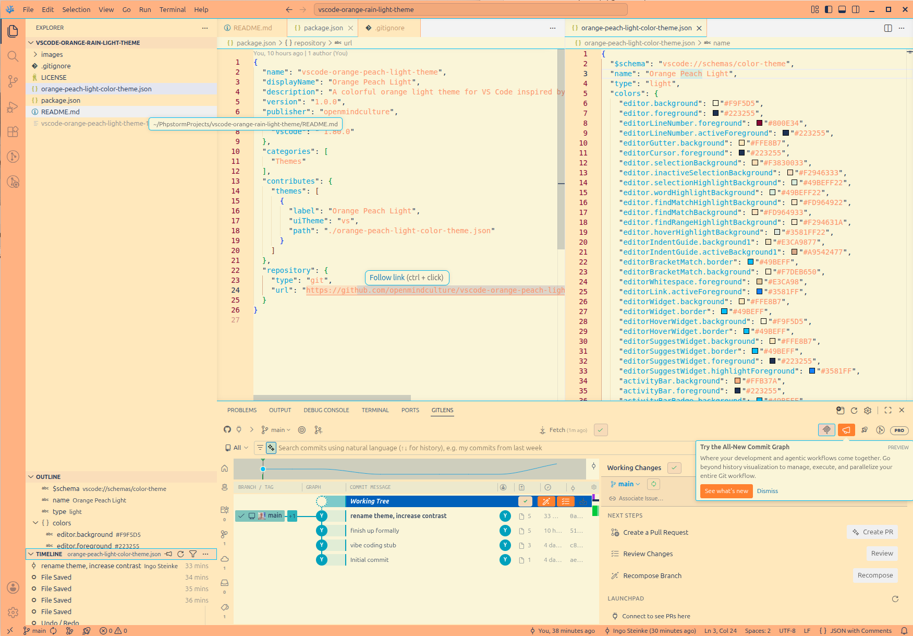
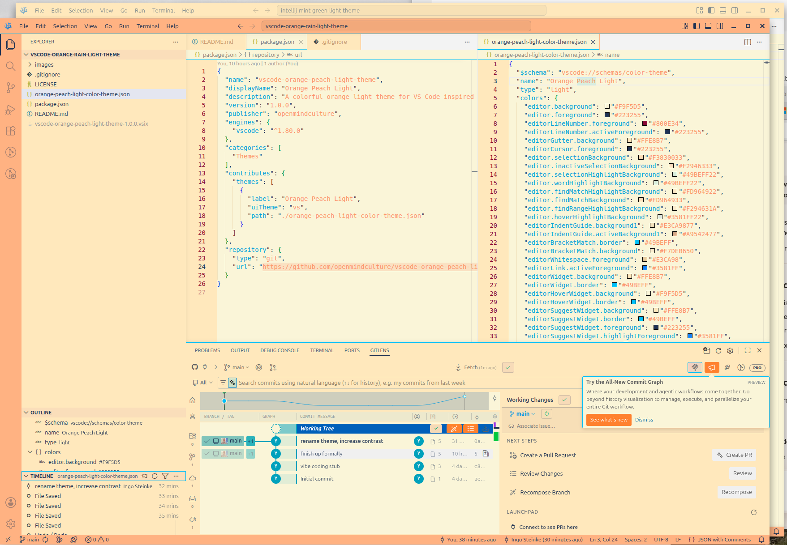
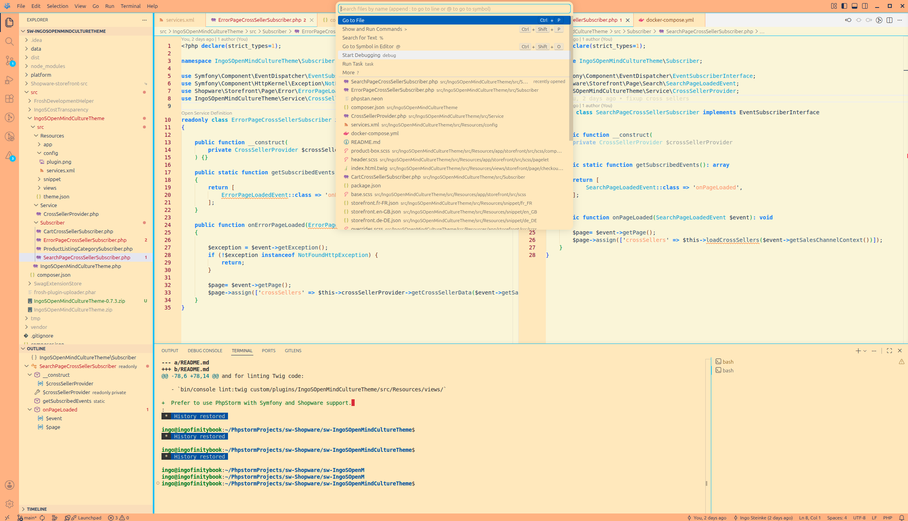

# Orange Peach Light Theme

A colorful orange light theme for VS Code and VS Codium inspired by [Orange Rain Light for IntelliJ editors](https://github.com/openmindculture/intellij-orange-rain-light-theme), published by Microsoft in the Visual Studio Marketplace at https://marketplace.visualstudio.com/items?itemName=openmindculture.vscode-orange-peach-light-theme and also available in the independent Open VSX repository at https://open-vsx.org/extension/openmindculture/vscode-orange-peach-light-theme .

## Features

* Light theme optimized for readability.
* Distinct orange accents for syntax highlighting and workbench elements.
* High contrast UI elements for easy navigation.

## Installation

1. Open **Extensions** in VS Code (`Ctrl+Shift+X` or `Cmd+Shift+X`).
2. Search for `Orange Peach Light`.
3. Click **Install**.
4. Select it via `Preferences: Color Theme`.

Local installation: 
`codium --install-extension vscode-orange-peach-light-theme-1.0.0.vsix`

## Screenshots

## License

[MIT](LICENSE)

## Theme Files

- `package.json` publishes the theme contribution.
- `orange-rain-light-color-theme.json` contains the VS Code color and token mappings.

### Development

- `vsce package`
- `vsce publish`
